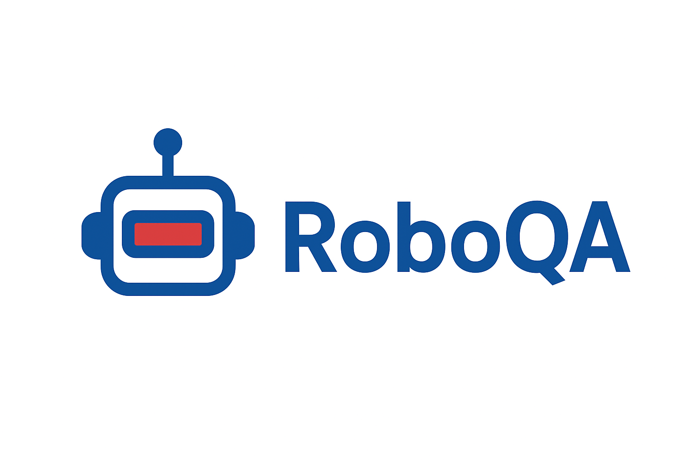

# RoboQA-Temporal

**Automated Quality Assessment and Anomaly Detection for Multi-Sensor Robotics Datasets**

RoboQA-Temporal is an open-source, professional Python toolkit focused on automated quality assessment and anomaly detection for multi-sensor robotics datasets, with a special focus on ROS2 bag files. It provides automated, objective, and reproducible health checks for robotics datasets used in ML, SLAM, and perception workflows.



## Design/Components/Stories:

### User Stories:
> User Stories for this project can be found here - [USER_STORIES.md](.docs/USER_STORIES.md)

### User Design:
> User Desigs for this project can be found here - [USER_STORIES.md](.docs/USER_DESIGN.md)

### User Components:
> User Components for this project can be found here - [USER_STORIES.md](.docs/USER_COMPONENTS.md)

## Installation

### Prerequisites

- Python 3.10 or higher
- ROS2 (for ROS2 bag file support) (Distro - Humble)

### Install from Source

```bash
# Clone the repository
git clone https://github.com/architjain19/roboqa-temporal.git
cd roboqa-temporal

# Install dependencies
pip install -r requirements.txt

# Install the package
pip install -e .
```

### Dependencies

- `numpy` >= 1.21.0
- `scipy` >= 1.7.0
- `scikit-learn` >= 1.0.0
- `open3d` >= 0.15.0
- `rclpy` >= 3.0.0
- `rosbag2-py` >= 0.9.0
- `sensor-msgs` >= 4.0.0
- `pandas` >= 1.3.0
- `matplotlib` >= 3.5.0
- `seaborn` >= 0.11.0
- `pyyaml` >= 6.0
- `tqdm` >= 4.62.0
- `tabulate` >= 0.9.0

<!-- ## Quick Start

### Usage

```bash
# Analyze a ROS2 bag file
roboqa path/to/bag_file.db3

# Specify output format
roboqa path/to/bag_file.db3 --output html

# Limit number of frames
roboqa path/to/bag_file.db3 --max-frames 1000

# Use configuration file
roboqa path/to/bag_file.db3 --config path/to/config.yaml

# Combined usage
roboqa path/to/bag_file.db3 --output html --max-frames 1000 --config path/to/config.yaml 

```

### Python API

```python
from roboqa_temporal import BagLoader, Preprocessor, AnomalyDetector, ReportGenerator

# Load bag file
loader = BagLoader("path/to/bag_file.db3")
frames = loader.read_all_frames(max_frames=1000)
loader.close()

# Preprocess
preprocessor = Preprocessor(voxel_size=0.05, remove_outliers=True)
frames = preprocessor.process_sequence(frames)

# Detect anomalies
detector = AnomalyDetector()
result = detector.detect(frames)

# Generate report
report_generator = ReportGenerator(output_dir="reports")
report_generator.generate(result, "bag_file.db3", output_format="all")
```

## Configuration

Create a YAML configuration file to customize analysis parameters:

```yaml
# config.yaml
topics:
  - /velodyne_points

max_frames: 1000

preprocessing:
  voxel_size: 0.05
  remove_outliers: true

detection:
  threshold: 0.5
  disabled: []

output: all
output_dir: reports
```

See `examples/config_example.yaml` for a complete configuration example. -->

## Project Structure

(For more details check [here](PROJECT_STRUCTURE.md))

```
RoboQA/
├── roboqa_temporal/          # Main package
│   ├── loader/               # ROS2 bag file loader
│   ├── preprocessing/        # Point cloud preprocessing
│   ├── detection/            # Anomaly detection algorithms
│   ├── reporting/            # Report generation
│   ├── cli/                  # Command-line interface
│   └── config/               # Configuration utilities
├── tests/                    # Unit tests
├── examples/                 # Example scripts and configs
├── .docs/                     # Documentation
└── README.md
```

## Features

### Core Capabilities

- **Automated Quality Assessment**: Objective and reproducible health checks for robotics datasets
- **Point Cloud Anomaly Detection**: Detects various anomalies in point cloud sequences:
  - **Density Drops & Occlusions**: Identifies sudden drops in point density
  - **Spatial Discontinuities**: Analyzes geometric changes and frame-to-frame transformations
  - **Ghost Points**: Highlights points likely due to reflections, multi-path returns, or hardware artifacts
  - **Temporal Inconsistency**: Quantifies smoothness and consistency in spatio-temporal evolution

### Key Features

- **ROS2 Bag Support**: Efficient reading and processing of ROS2 bag files
- **Modular Architecture**: Extensible design with separate modules for loading, preprocessing, detection, and reporting
- **Multiple Output Formats**: Generate reports in Markdown, HTML (with visualizations), and CSV
- **Comprehensive CLI**: Easy-to-use command-line interface
- **Configuration Support**: YAML-based configuration files for flexible parameter tuning
- **Visualization**: Interactive plots and charts in HTML reports

## Contributing

> Contributions are welcome! Please checkout instructions for contributing here - [CONTRIBUTING](CONTRIBUTING.md)

## License

[MIT License](LICENSE)

## Support

For issues, questions, or contributions, please open an issue on GitHub.

## Acknowledgments

Built for the robotics research community to improve dataset quality and reliability.

### Authors/Contributors
- Archit Jain ( [architj@uw.edu](mailto:architj@uw.edu) )
- Dharineesh Somisetty ( [dhar007@uw.edu](mailto:dhar007@uw.edu) )
- Xinxin Tai ( [xtaiuw@uw.edu](mailto:xtaiuw@uw.edu) )
- Sayali Nehul ( [snehul@uw.edu](mailto:snehul@uw.edu))
